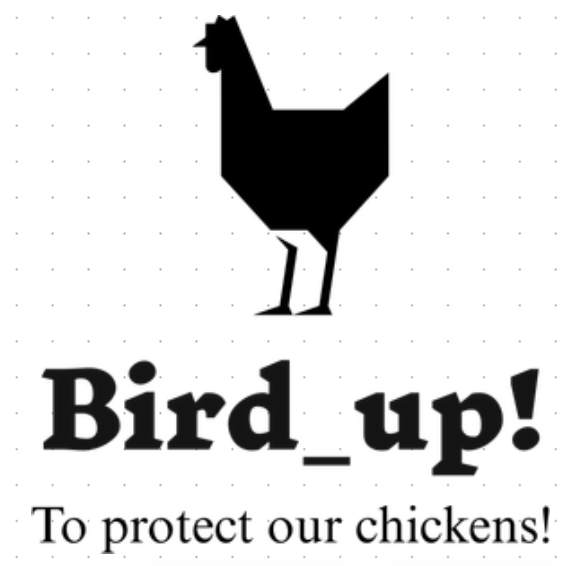

# Bird_Up! 🐓

## To protect our chickens! 

---

<!--- See our devpost [here](https://devpost.com/software/reboot-0eyc7p): [devpost.com/software/reboot-0eyc7p](https://devpost.com/software/reboot-0eyc7p) --->

## 📑 Project Details

## Inspiration
People eat a lot of eggs, in fact, according to [statistics](https://www.statista.com/statistics/183678/per-capita-consumption-of-eggs-in-the-us-since-2000/) in 2019, consumption of eggs in the United States was estimated at 293.6 eggs per person. Thus on average, a person spends about 411$ per year on eggs as the [average price](https://www.statista.com/statistics/183678/per-capita-consumption-of-eggs-in-the-us-since-2000/) was 1.4$ in 2019.   
   
Due to inflation, many may choose to raise their own chickens. However, that requires commitment, we aim to help automate this process.

## What it does

### Automatic light sensor door
No longer do you have to get up early in the mornings, or panic when you are away from home and you forgot to lock your chickens up for the night.  The automatic light sensor detects when the sun goes up and down ensuring your birds sleep sound.

https://youtu.be/-Oy08sSHBTI

### Remote viewing of chickens
You can remotely connect to your chicken coop and move the camera as you need to make sure all your lovely ladies are doing fine.

https://youtu.be/259Wf4aDriA

### Predator Detection
Chickens are often prone to predators but using machine learning we can detect exactly where a predator is and fire our patented predator cannon to keep predators away.

https://youtu.be/r203pE_IT9w 

   

## How we built it
We built a basic structure prototype using Lego Mindstorms and electrical tape to hold things together.  
To power our vision processing we used a Jetson Nano which has enough built-in computer power to stream our raspberry pi camera and process an object detection model in real-time.  
For controlling motors and sensors we used an Arduino Nano.  For the camera mount, we have two servos controlled manually using a joystick or can be controlled automatically moving towards predators using the GPIO output from the Jetson Nano (currently in development).  The automatic door uses a photoresistor and a servo to open the pen when the sun comes up and closes it when the sun goes down.

## Challenges we ran into
We weren't able to interact with the hardware equipment in person which led to real limitations. We tackled this by using an SSH server to connect to the jetson nano and this allowed us to access the camera to test the object detection model. Furthermore, we remotely collaborated on the Arduino code.
Quick communication was also one of the challenges as we had to reboot the server a couple of times so we were always active on discord and ensured we rebooted the server when no one was in the midst of coding.

## Accomplishments that we're proud of
This was a hardware project in a fully online setting so we are really proud of being able to procure the parts needed and assemble them in quick time as well as incorporating, testing and debugging the object detection model.

## What we learned
We learnt how to use OpenCV and CUDA it was a steep learning curve as we were not familiar with it.

## What's next for Bird_Up!
We are planning on adding more predator and hazards classes to our model to make the system more robust.  Additional features as heat control and egg detection would also be useful!

## 🔨 Tools

### Software
* PyTorch
* OpenCV
* YOLO.V3 

### Hardware
* Jetson nano
* Arduino
* 3 Servos
* 1 photoresistor
* Raspberry Pi camera
* Analog joystick

## How to run:

- Setup arduino as per pin diagram found on [link to board diagram]
- Object Dection Image Stream: 
   - pip3 install -r requirements.txt
   - python3 ~/Bird_Up/yolo/live_yolo_opencv.py
- ROS Image Stream:
   - install ros melodic
   - install tmuxinator
   - tmuxinator start jetbot_stack -n jetbot_stack -p ~/Bird_Up/workspace/scripts/stack.yml

## 👨‍👧‍👧 Team

<!--- put your links here --->

* [Faiyaz Ahmed](https://github.com/Faiyaz42)
* [Justin Francis](https://github.com/wagonhelm)
* [Akrash Sharma](https://github.com/Akarsh654/)

[🔝 Back to Top](#top)
